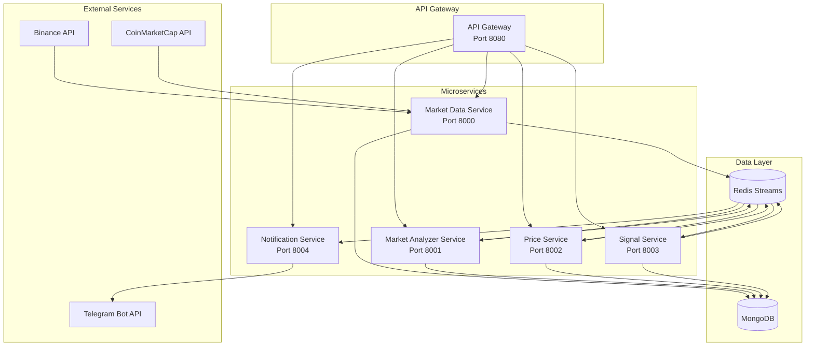

# System Architecture

## High-Level Architecture

## Service Responsibilities

1. **Market Data Service**: Fetches price data, candlesticks, and market metrics from external APIs
2. **Market Analyzer Service**: Analyzes market data using technical analysis theories
3. **Price Service**: Monitors live prices and detects volatility
4. **Signal Service**: Generates trading signals based on analysis
5. **Notification Service**: Sends notifications via Telegram

