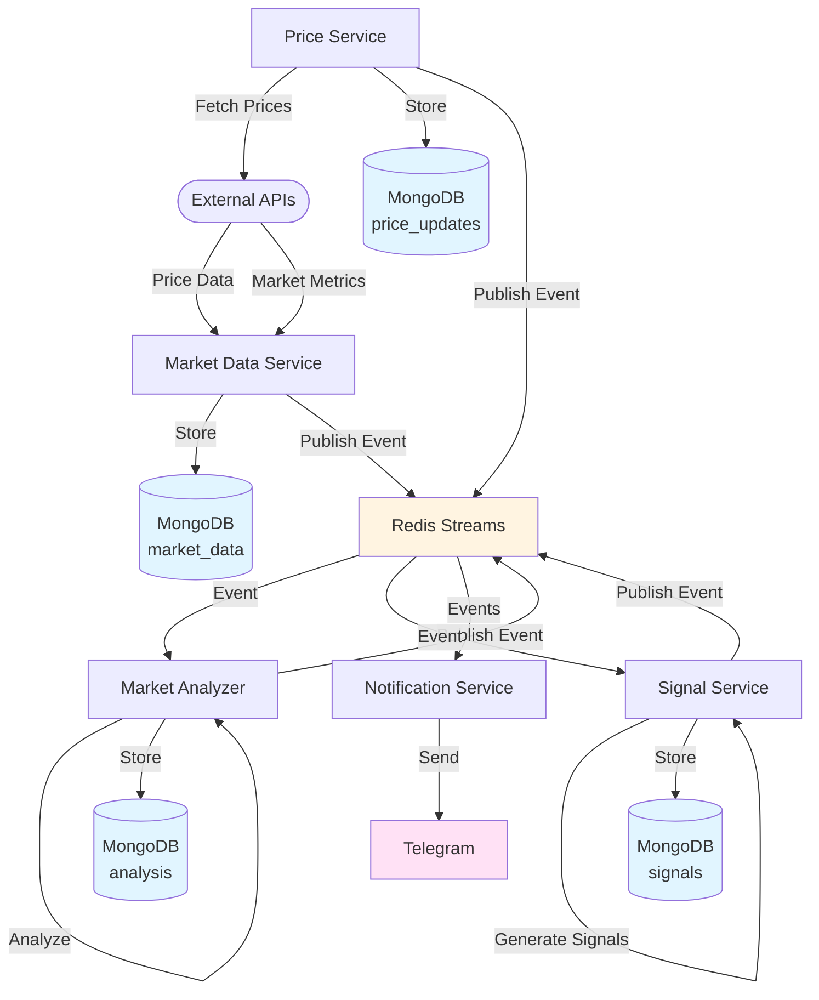

# Data Flow Diagram

## Data Flow Through System

## Database Collections

- **market_data**: Raw market data (prices, candlesticks, metrics)
- **analysis**: Market analysis results (sentiment, trends, indicators)
- **signals**: Generated trading signals
- **price_updates**: Real-time price updates
- **logs**: System logs (warnings and errors)

