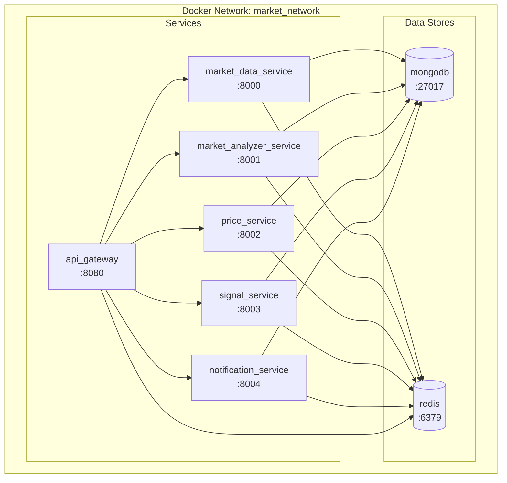

# Deployment Architecture

## Docker Compose Deployment

## Health Checks

All services expose health check endpoints:
- `/health` - Basic health check
- `/ready` - Readiness check
- `/status` - Detailed status
- `/metrics` - Prometheus metrics

## Service Ports

- Market Data Service: 8000
- Market Analyzer Service: 8001
- Price Service: 8002
- Signal Service: 8003
- Notification Service: 8004
- API Gateway: 8080

