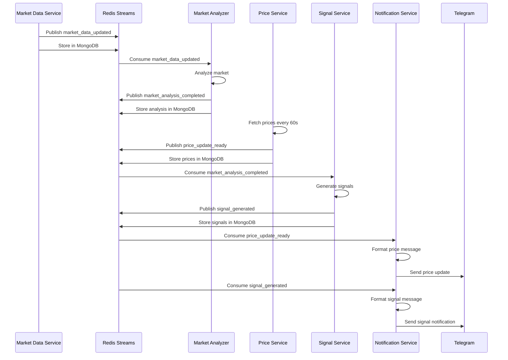
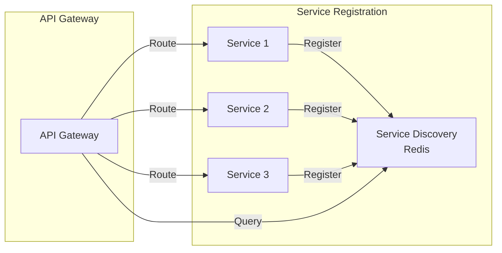

# Service Interaction Diagram

## Event-Driven Communication Flow

```mermaid
sequenceDiagram
    participant MD as Market Data Service
    participant Redis as Redis Streams
    participant MA as Market Analyzer
    participant PS as Price Service
    participant SS as Signal Service
    participant NS as Notification Service
    
    MD->>Redis: Publish market_data_updated
    MD->>Redis: Store in MongoDB
    
    Redis->>MA: Consume market_data_updated
    MA->>MA: Analyze market
    MA->>Redis: Publish market_analysis_completed
    MA->>Redis: Store analysis in MongoDB
    
    PS->>PS: Fetch prices every 60s
    PS->>Redis: Publish price_update_ready
    PS->>Redis: Store prices in MongoDB
    
    Redis->>SS: Consume market_analysis_completed
    SS->>SS: Generate signals
    SS->>Redis: Publish signal_generated
    SS->>Redis: Store signals in MongoDB
    
    Redis->>NS: Consume price_update_ready
    NS->>NS: Format price message
    NS->>Telegram: Send price update
    
    Redis->>NS: Consume signal_generated
    NS->>NS: Format signal message
    NS->>Telegram: Send signal notification
```

## Service Discovery

```mermaid
graph LR
    subgraph "Service Registration"
        S1[Service 1] -->|Register| SD[Service Discovery<br/>Redis]
        S2[Service 2] -->|Register| SD
        S3[Service 3] -->|Register| SD
    end
    
    subgraph "API Gateway"
        AG[API Gateway] -->|Query| SD
        AG -->|Route| S1
        AG -->|Route| S2
        AG -->|Route| S3
    end
```

